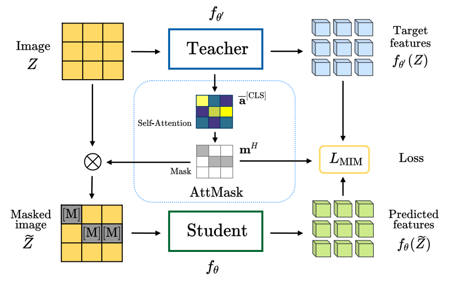

<h1 align="center"> {{page.title}} </h1>
<!-- Simple call of authors -->
<!-- <h3 align="center"> {{page.authors}} </h3> -->
<!-- Alternatively you can add links to author pages -->
<h3 align="center"> <a href="https://scholar.google.com/citations?user=B_dKcz4AAAAJ">Ioannis Kakogeorgiou</a>&nbsp;&nbsp; <a href="https://scholar.google.com/citations?user=7atfg7EAAAAJ&hl=en">Spyros Gidaris</a>&nbsp;&nbsp;  <a href="http://users.ntua.gr/psomasbill/">Bill Psomas</a> &nbsp;&nbsp;  <a href="https://avrithis.net/">Yannis Avrithis</a> &nbsp;&nbsp; <a href="https://abursuc.github.io/">Andrei Bursuc</a>&nbsp;&nbsp;  <a href="http://users.ntua.gr/karank/">Konstantinos Karantzalos</a> &nbsp;&nbsp;  <a href="https://www.csd.uoc.gr/~komod/">Nikos Komodakis</a></h3>

<h3 align="center"> {{page.venue}} {{page.year}} </h3>

  

    
    <a href="{{ page.paper_url }}"><i class="far fa-file-pdf"></i> Paper</a>&nbsp;&nbsp;
    
    
    <a href="{{ page.code_url }}"><i class="fab fa-github"></i> Code</a> &nbsp;&nbsp;
    
    
    <a href="{{ page.blog_url }}"><i class="fab fa-blogger"></i> Blog</a> &nbsp;&nbsp;
    
    
    <a href="{{ page.slides_url }}"><i class="far fa-file-pdf"></i> Slides</a>&nbsp;&nbsp;
    
    
    <a href="{{ page.bib_url}}"><i class="far fa-file-alt"></i> BibTeX</a>&nbsp;&nbsp;
    
  

{:width="100%"}

<h2  align="center"> Abstract</h2>

Transformers and masked language modeling are quickly being adopted and explored in computer vision as vision transformers and masked image modeling (MIM). In this work, we argue that image token masking differs from token masking in text, due to the amount and correlation of tokens in an image. In particular, to generate a challenging pretext task for MIM, we advocate a shift from random masking to informed masking. We develop and exhibit this idea in the context of distillation-based MIM, where a teacher transformer encoder generates an attention map, which we use to guide masking for the student. We thus introduce a novel masking strategy, called attention-guided masking (AttMask), and we demonstrate its effectiveness over random masking for dense distillation-based MIM as well as plain distillation-based self-supervised learning on classification tokens. We confirm that AttMask accelerates the learning process and improves the performance on a variety of downstream tasks.

 

<h2  align="center">BibTeX</h2>
<left>
  <pre class="bibtex-box">
@inproceedings{kakogeorgiou2022hide,
  title={What to Hide from Your Students: Attention-Guided Masked Image Modeling},
  author={Kakogeorgiou, Ioannis and Gidaris, Spyros and Psomas, Bill and Avrithis, Yannis and Bursuc, Andrei and Karantzalos, Konstantinos and Komodakis, Nikos},
  booktitle={ECCV},
  year={2022}
}</pre>
</left>

 
