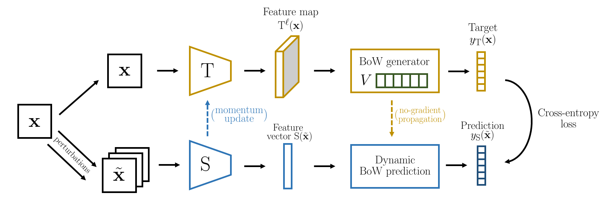
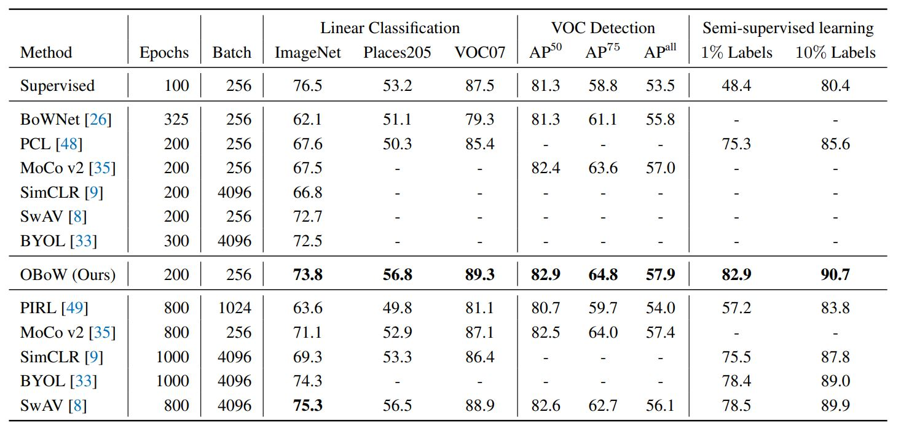

<h1 align="center"> {{page.title}} </h1>
<!-- Simple call of authors -->
<!-- <h3 align="center"> {{page.authors}} </h3> -->
<!-- Alternatively you can add links to author pages -->
<h3 align="center"> <a href="https://scholar.google.com/citations?user=7atfg7EAAAAJ&hl=en">Spyros Gidaris</a>&nbsp;&nbsp; <a href="https://abursuc.github.io/">Andrei Bursuc</a>&nbsp;&nbsp; <a href="https://sites.google.com/site/puygilles/home">Gilles Puy</a>&nbsp;&nbsp;  <a href="https://www.csd.uoc.gr/~komod/">Nikos Komodakis</a>   <a href="https://ptrckprz.github.io/">Patrick Pérez</a>&nbsp;&nbsp; <a href="https://cord.isir.upmc.fr/">Matthieu Cord</a> </h3>

<h3 align="center"> {{page.venue}} {{page.year}} </h3>

  

    
    <a href="{{ page.paper_url }}"><i class="far fa-file-pdf"></i> Paper</a>&nbsp;&nbsp;
    
    
    <a href="{{ page.code_url }}"><i class="fab fa-github"></i> Code</a> &nbsp;&nbsp;
    
    
    <a href="{{ page.blog_url }}"><i class="fab fa-blogger"></i> Blog</a> &nbsp;&nbsp;
    
    
    <a href="{{ page.slides_url }}"><i class="far fa-file-pdf"></i> Slides</a>&nbsp;&nbsp;
    
    
    <a href="{{ page.bib_url}}"><i class="far fa-file-alt"></i> BibTeX</a>&nbsp;&nbsp;
    
  

{:width="100%"}

<h2  align="center"> Abstract</h2>

Learning image representations without human supervision is an important and active research field. Several recent approaches have successfully leveraged the idea of making such a representation invariant under different types of perturbations, especially via contrastive-based instance discrimination training. Although effective visual representations should indeed exhibit such invariances, there are other important characteristics, such as encoding contextual reasoning skills, for which alternative reconstruction-based approaches might be better suited.
 
With this in mind, we propose a teacher-student scheme to learn representations by training a convnet to reconstruct a bag-of-visual-words (BoW) representation of an image, given as input a perturbed version of that same image. Our strategy performs an online training of both the teacher network (whose role is to generate the BoW targets) and the student network (whose role is to learn representations), along with an online update of the visual-words vocabulary (used for the BoW targets). This idea effectively enables fully online BoW-guided unsupervised learning. Extensive experiments demonstrate the interest of our BoW-based strategy which surpasses previous state-of-the-art methods (including contrastive-based ones) in several applications. For instance, in downstream tasks such Pascal object detection, Pascal classification and Places205 classification, our method improves over all prior unsupervised approaches, thus establishing new state-of-the-art results that are also significantly better even than those of supervised pre-training.

 

<h2  align="center"> Results</h2>

<b>Evaluation of ImageNet pre-trained ResNet50 models.</b> The ''Epochs'' and ''Batch'' columns provide the number of pre-training epochs and the batch size of each model respectively.
The first section includes models pre-trained with a similar number of epochs as our model (second section). 
We boldfaced the best results among all sections as well as of only the top two.
For the linear classification tasks, we provide the top-1 accuracy.
For object detection, we fine-tuned Faster R-CNN (R50-C4) on VOC $\texttt{trainval07+12}$ and report detection AP scores by testing on $\texttt{test07}$.
For semi-supervised learning, we fine-tune the pre-trained models on $1\%$ and $10\%$ of ImageNet and report the top-5 accuracy.
Note that, in this case the ''Supervised'' entry results come from (<a href="https://arxiv.org/abs/1905.03670" target="_blank">Zhai et al.</a>) and are obtained by supervised training 
using only $1\%$ or $10\%$ of the labelled data.
All the classification results are computed with single-crop testing. $^\dagger$: results computed by us. 

<h2  align="center">BibTeX</h2>
<left>
  <pre class="bibtex-box">
@inproceedings{gidaris2021obow,
    title={Learning Representations by Predicting Bags of Visual Words},
    author={Gidaris, Spyros and Bursuc, Andrei and Puy, Gilles and Komodakis, Nikos and Cord, Matthieu and P{\'e}rez, Patrick},
    booktitle={Proceedings of the IEEE/CVF Conference on Computer Vision and Pattern Recognition},
    year={2021}
}</pre>
</left>

 
