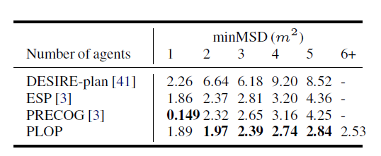
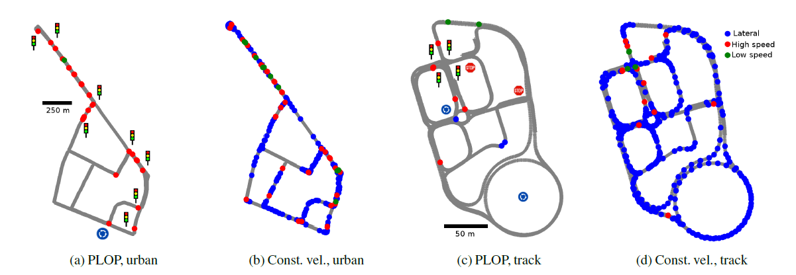

<h1 align="center"> {{page.title}} </h1>
<!-- Simple call of authors -->
<!-- <h3 align="center"> {{page.authors}} </h3> -->
<!-- Alternatively you can add links to author pages -->
<h3 align="center"> <a href="https://scholar.google.com/citations?user=TLRo9J0AAAAJ&hl=en&oi=ao">Thibault Buhet</a> &nbsp;&nbsp; <a href="https://scholar.google.com/citations?user=Z7wRy_cAAAAJ&hl=en">Emilie Wirbel</a>&nbsp;&nbsp; <a href="https://abursuc.github.io/">Andrei Bursuc</a>&nbsp;&nbsp; <a href="https://scholar.google.com/citations?hl=en&user=PBfow1oAAAAJ">Xavier Perrotton</a></h3>

<h3 align="center"> {{page.venue}} {{page.year}} </h3>

  

    
    <a href="{{ page.paper_url }}"><i class="far fa-file-pdf"></i> Paper</a>&nbsp;&nbsp;
    
    
    <a href="{{ page.code_url }}"><i class="fab fa-github"></i> Code</a> &nbsp;&nbsp;
    
    
    <a href="{{ page.blog_url }}"><i class="fab fa-blogger"></i> Blog</a> &nbsp;&nbsp;
    
    
    <a href="{{ page.slides_url }}"><i class="far fa-file-pdf"></i> Slides</a>&nbsp;&nbsp;
    
    
    <a href="{{ page.bib_url}}"><i class="far fa-file-alt"></i> BibTeX</a>&nbsp;&nbsp;
    
  

    

<h2  align="center"> Abstract</h2>

To navigate safely in urban environments, an autonomous vehicle (*ego vehicle*) must understand and anticipate its surroundings, in particular the behavior and intents of other road users (*neighbors*). Most of the times, multiple decision choices are acceptable for all road users (e.g., turn right or left, or different ways of avoiding an obstacle), leading to a highly uncertain and multi-modal decision space. We focus here on predicting multiple feasible future trajectories for both ego vehicle and neighbors through a probabilistic framework. We rely on a conditional imitation learning algorithm, conditioned by a navigation command for the ego vehicle (e.g., *turn right*). Our model processes ego vehicle front-facing camera images and bird-eye view grid, computed from Lidar point clouds, with detections of past and present objects, in order to generate multiple trajectories for both ego vehicle and its neighbors. Our approach is computationally efficient and relies only on on-board sensors. We evaluate our method offline on the publicly available dataset nuScenes, achieving state-of-the-art performance, investigate the impact of our architecture choices on online simulated experiments and show preliminary insights for real vehicle control.

 

<h2  align="center"> Results</h2>

  

<b>Comparison on nuScenes 4s prediction</b> with published results of DESIRE-plan, ESP and PRECOG from rhinehart et al. (results from their Table II, with a fixed 5 agents training), over minMSD metric.

<b>Closed loop error locations for urban and track test data (internal data)</b>, visualized for PLOP and constant velocity baseline. We note that braking behind a vehicle can induce multiple high speed errors and stack multiple red dots on the same location. Points of interest (traffic lights, roundabout, stop signs) are highlighted on the map.

<h2 align="center"> Video</h2>

  <iframe width="560" height="315" src="https://www.youtube.com/embed/94FwahFmc5A" frameborder="0" allow="accelerometer; autoplay; clipboard-write; encrypted-media; gyroscope; picture-in-picture" allowfullscreen align="center"></iframe>

 

<h2  align="center">BibTeX</h2>
<left>
  <pre class="bibtex-box">
  @article{buhet2020plop,
    title={PLOP: Probabilistic poLynomial Objects trajectory Planning for autonomous driving},
    author={Buhet, Thibault and Wirbel, Emilie and Bursuc, Andrei and Perrotton, Xavier},
    journal={Conference on Robot Learning (CoRL)},
    year={2020}
  }</pre>
</left>

 

